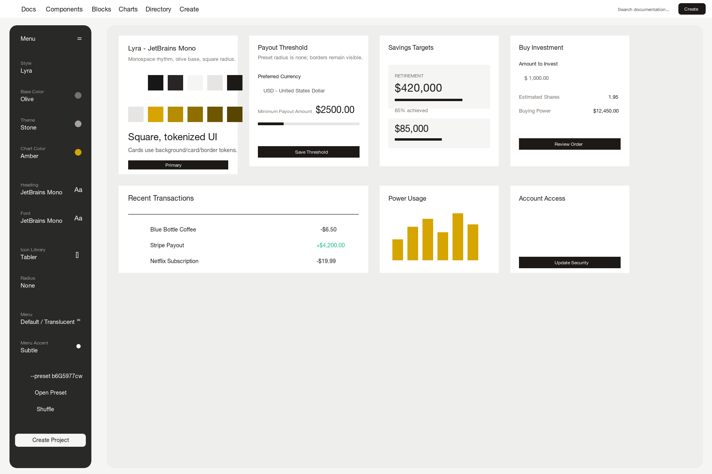
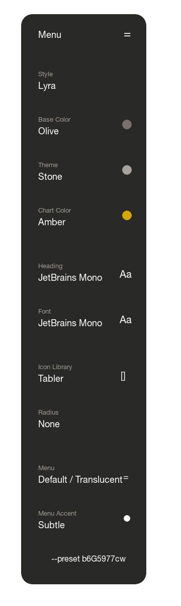

# shadcn/ui Update Strategy

Desiderio uses shadcn/ui as a design source for TYPO3 Fluid components and
Content Blocks. React components from the registry are not shipped in the
frontend.

The important rule is simple: shadcn/create preset ids are converted into
committed CSS tokens and TYPO3 Site Settings. There is no runtime downloader,
binary switcher, or remote preset fetch in production.

## Preset Layers

People often call two different things "templates":

1. Desiderio site preset sets, for example
   `webconsulting/desiderio-preset-saas`. These change broad TYPO3 defaults
   such as header, footer, density, container width, and layout radius.
2. shadcn/create preset ids, for example `b4hb38Fyj` or `b6G5977cw`. These
   change CSS tokens for surfaces, borders, radius, charts, typography, and
   dark mode.

Switch an already-supported shadcn preset by changing
`desiderio.shadcn.preset` in **Site Management -> Settings**. The value is
rendered to `<body data-shadcn-preset="...">`. The visual change only happens
when `Resources/Public/Css/shadcn-theme.css` contains a matching light and dark
token block.

## Supported shadcn Presets

| Preset id | Source style | Notes |
| --- | --- | --- |
| `b6G5977cw` | `radix-lyra` | Default Lyra mono olive preset with square radius and amber charts. |
| `b4hb38Fyj` | `radix-mira` | Olive product system with Nunito Sans. |
| `b0` | shadcn default | Neutral fallback tokens in `:root` and `.dark`. |
| `b3IWPgRwnI` | `radix-mira` | Mist dashboard tokens with Geist and JetBrains Mono. |
| `custom` | custom | Requires a matching custom token block. |

## b6G5977cw Reference

The `b6G5977cw` preset was inspected with:

```bash
npx shadcn@latest init --template vite --preset b6G5977cw \
  --cwd /tmp/desiderio-shadcn-b6G5977cw \
  --name preset-b6G5977cw \
  --yes --no-monorepo --no-reinstall
```

The generated `components.json` reports:

| shadcn/create control | Value |
| --- | --- |
| Style | `radix-lyra` |
| Base Color | `olive` |
| Theme | `stone` token family |
| Chart Color | amber/yellow chart tokens |
| Heading | JetBrains Mono through `--font-heading: var(--font-mono)` |
| Font | JetBrains Mono |
| Icon Library | `tabler` |
| Radius | `0` / square |
| Menu | `default-translucent` |
| Menu Accent | `subtle` |





## Switch To b6G5977cw In TYPO3

Use these exact steps when the code already contains the `b6G5977cw` token
block:

1. Open the TYPO3 backend.
2. Go to **Site Management -> Settings**.
3. Select the site that uses the Desiderio set.
4. Set `desiderio.shadcn.preset` to `b6G5977cw`.
5. Set `desiderio.shadcn.style` to `radix-lyra` if you want the stored source
   metadata to match the preset.
6. Set `desiderio.layout.radius` to `preset` if the shadcn preset should own
   the radius.
7. Use `desiderio.layout.radius = none` only when you want to force square
   corners even after switching to a different preset.
8. Leave `desiderio.typography.fontSans = preset` if the shadcn preset should
   own the font.
9. Choose `desiderio.theme.darkModeDefault` as `light`, `dark`, or `system`.
10. Save the settings.
11. Flush TYPO3 caches.
12. Open a frontend page in light mode.
13. Open the same page in dark mode.
14. Check cards, buttons, charts, form fields, borders, and media corners.
15. Open the Desiderio styleguide page if enabled.
16. Open the TYPO3 Page/Layout module and check backend previews.

If a Desiderio site preset set also sets `desiderio.layout.radius`, that site
preset intentionally overrides the shadcn radius. Change it back to `preset`
when you want the selected shadcn preset to control radius again.

## Add A New shadcn/create Preset

Use this workflow for ids that are not already in the enum/CSS.

1. Start from a clean or understood git state.
2. Create a branch or commit the current work before changing tokens.
3. Copy the shadcn/create preset id from the URL, for example `b6G5977cw`.
4. Create a scratch directory outside the extension.
5. Run:

   ```bash
   npx shadcn@latest init --template vite --preset <id> \
     --cwd /tmp/desiderio-shadcn-presets \
     --name preset-<id> \
     --yes --no-monorepo --no-reinstall
   ```

6. Open the generated `components.json`.
7. Record `style`.
8. Record `tailwind.baseColor`.
9. Record `iconLibrary`.
10. Record `menuColor`.
11. Record `menuAccent`.
12. Open the generated Tailwind CSS file, usually `src/index.css`.
13. Copy every light `:root` token.
14. Copy every `.dark` token.
15. Copy font imports and font-family choices.
16. Add a light block to
    `Resources/Public/Css/shadcn-theme.css`:

    ```css
    body[data-shadcn-preset="<id>"] {
      /* copied light tokens */
    }
    ```

17. Add the dark block directly after it:

    ```css
    .dark body[data-shadcn-preset="<id>"] {
      /* copied dark tokens */
    }
    ```

18. Map upstream font variables to Desiderio variables such as
    `--d-font-sans`, `--d-font-heading`, and `--d-font-mono`.
19. Preserve semantic token names such as `--background`, `--foreground`,
    `--card`, `--primary`, `--border`, `--ring`, and `--chart-1`.
20. Do not hardcode colors inside Fluid templates.
21. Do not add React runtime components to the TYPO3 frontend.
22. Add the new id to `desiderio.shadcn.preset` in
    `Configuration/Sets/Desiderio/settings.definitions.yaml`.
23. Add the source style to `desiderio.shadcn.style` if it is new.
24. Keep `Configuration/Sets/Desiderio/settings.yaml` on the existing default
    unless the project intentionally changes the global default.
25. If the preset radius should be respected, set the default or site value of
    `desiderio.layout.radius` to `preset`.
26. Add or refresh documentation screenshots under `Documentation/Images/`.
27. Update `README.md`.
28. Update this file.
29. Update tests that assert supported preset ids.
30. Run `npm run build:css` when Fluid class recipes or Tailwind sources
    changed.
31. Run `composer test`.
32. Run `git diff --check`.
33. Flush TYPO3 caches.
34. Verify the frontend in light mode.
35. Verify the frontend in dark mode.
36. Verify the styleguide overview.
37. Verify TYPO3 backend layout previews.
38. Commit the token/settings/docs changes.

Changing only `settings.yaml` or Site Settings to an unsupported id is not
enough. TYPO3 will render the body attribute, but no CSS variables will change
without matching committed token blocks.

## Left-Nav Support Matrix

The shadcn/create left navigation exposes more controls than Desiderio currently
stores as independent TYPO3 switches. Desiderio supports the full preset as a
committed preset, but not every left-nav value is an independent runtime setting.

| shadcn/create value | Desiderio support |
| --- | --- |
| Style | Stored as `desiderio.shadcn.style`; component class contracts are ported manually into Fluid components. |
| Base Color | Supported through the selected preset token block. Not an independent TYPO3 setting. |
| Theme | Supported through the selected preset token block. Not an independent TYPO3 setting. |
| Chart Color | Supported through `--chart-1` to `--chart-5`. Not an independent TYPO3 setting. |
| Heading | Supported through preset font tokens and `--d-font-heading`. |
| Font | Supported through preset font tokens. `desiderio.typography.fontSans` can override it. |
| Icon Library | Not a runtime switch. TYPO3 Content Block icons are committed SVG files using `currentColor`. |
| Radius | Supported through preset tokens when `desiderio.layout.radius = preset`; otherwise the site radius setting overrides it. |
| Menu | Partially supported by Desiderio header/site styles. The shadcn `menuColor` value is documented but not yet an independent setting. |
| Menu Accent | Documented from the preset. Not yet an independent TYPO3 setting. |
| `--preset <id>` | Supported when the id exists in Site Settings and `shadcn-theme.css`. |

To support every left-nav value as an independent TYPO3 runtime switch, add new
Site Settings, render them as `<body data-*>` attributes in TypoScript, add CSS
rules for each value, and update tests/docs. Until then, use preset ids for
faithful shadcn/create styles.

## Component Updates

Use `npx shadcn@latest view <component>` or a temporary scratch app to inspect
upstream class recipes. Port the class strings, slots, `data-state`, and ARIA
behavior into Fluid components under `Resources/Private/Components`.

Keep Content Block `config.yaml`, field identifiers, fixtures, and template
filenames stable unless the content model is intentionally changing.

## Visual QA

Use the Desiderio styleguide page as the all-content-elements overview. Check
both light and dark mode, and verify that cards, buttons, forms, tabs,
accordions, tables, and charts use shadcn tokens instead of one-off colors.
