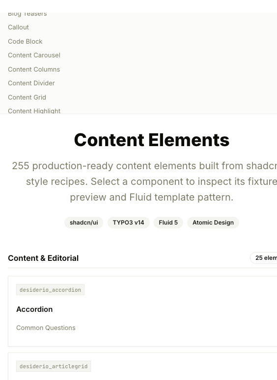
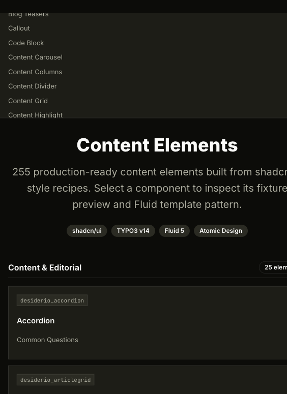
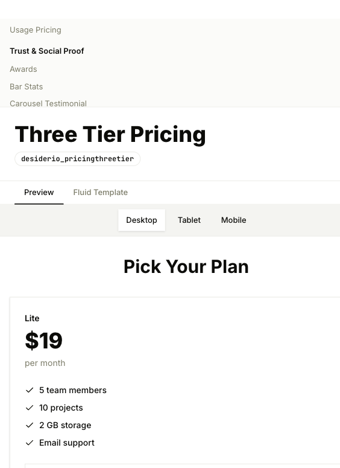
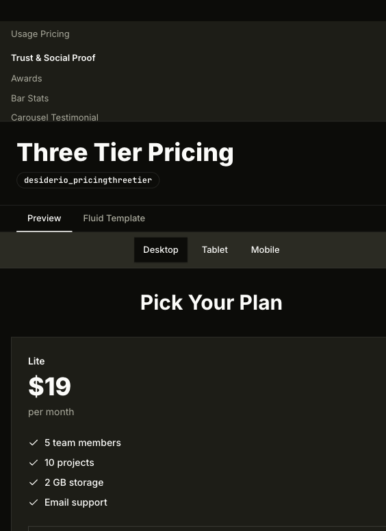

# Desiderio

[](https://github.com/webconsulting/desiderio/actions/workflows/ci.yml)


A self-contained TYPO3 v14.3 LTS theme extension that bundles a
[shadcn/ui](https://ui.shadcn.com)-inspired Fluid 5 component library, **255
content elements**, backend layouts, page templates, and five swappable
visual presets with a committed Tailwind v4/shadcn CSS build.

**Status:** stable · **Version:** 2.2.0 · **TYPO3:** v14.3 LTS only ·
**PHP:** 8.3 — 8.5 · **License:** GPL-2.0-or-later

> Desiderio 2.0 replaces both `webconsulting/desiderio 1.x` and
> `webconsulting/shadcn2fluid-templates 3.x`. No backward compatibility; clean
> installs only. See [SPECIFICATION.md](SPECIFICATION.md) and
> [MIGRATION-PLAN.md](MIGRATION-PLAN.md) for the rewrite rationale.
>
> The old `shadcn2fluid_*` fixture mapping is not used at runtime or by the
> styleguide seed. Demo content now lives beside each Content Block in its own
> `fixture.json`, keyed by the current `desiderio_*` CType generated from the
> Content Block folder.

## Three-layer architecture

```
┌──────────────────────────────────────────────────────────┐
│ Layer 3 — THEME                                          │
│ Page templates · Backend layouts · Header/Footer · Presets │
└──────────────────────────────────────────────────────────┘
                          ▲ renders via PAGEVIEW
┌──────────────────────────────────────────────────────────┐
│ Layer 2 — CONTENT ELEMENTS (Content Blocks)              │
│ 255 editor-facing elements in 10 wizard groups           │
└──────────────────────────────────────────────────────────┘
                          ▲ composes via <d:…>
┌──────────────────────────────────────────────────────────┐
│ Layer 1 — COMPONENTS (Fluid 5)                           │
│ 16 atoms · 17 molecules · 4 layouts (typed <f:argument>) │
└──────────────────────────────────────────────────────────┘
```

## Screenshots

The screenshots below are captured from the Desiderio styleguide app using the
committed `b6G5977cw` shadcn/create preset and real Content Block fixture data.

| Light mode | Dark mode |
| --- | --- |
|  |  |
| The styleguide overview shows the searchable content element catalog, group navigation, and the first generated cards for the 255 shipped elements. | The same overview in dark mode verifies the token-driven surface, sidebar, badges, cards, and text contrast. |
|  |  |
| A selected `Three Tier Pricing` element shows the component inspector with the preview tab, viewport controls, and rendered pricing fixture. | The dark-mode version shows the same element preview after the theme tokens switch, including borders, foreground text, and muted labels. |

## Installation

Requires TYPO3 14.3 LTS (no v13 fallback) and PHP 8.3 – 8.5. The
`webconsulting/desiderio` package pulls in `typo3/cms-workspaces ^14.3` so
draft/preview workflows are available out of the box.

```bash
composer require webconsulting/desiderio
vendor/bin/typo3 extension:setup
vendor/bin/typo3 cache:flush
```

Then enable the base site set plus one of the five presets:

1. Site Management → Sites → edit the target site
2. Add `Desiderio Base` (`webconsulting/desiderio`)
3. Add one of the five preset sets (see below)
4. Save and flush caches

### Tooling baseline

| Tool | Version pin | Why |
| --- | --- | --- |
| TYPO3 | `^14.3` | LTS, only supported branch — v13 is **not** supported. |
| PHP | `^8.3` (8.3 – 8.5) | Matches TYPO3 v14.3 LTS support matrix. |
| Workspaces | `^14.3` | Required, not optional, for editorial preview. |
| PHPStan | `^2.1`, **level max** | Plus `saschaegerer/phpstan-typo3` and `phpstan-strict-rules`. |
| PHPUnit | `^11.5` | All 88 unit tests pass via `Build/Scripts/runTests.sh`. |
| Content Blocks | `^2.2` | Drives every one of the 255 content elements. |

The base set also pulls in `webconsulting/desiderio-content-elements`, a single
aggregate set for the full Content Blocks catalog. Individual generated
`desiderio/*` content block set names are hidden from the backend picker to keep
site setup focused on the Desiderio-level sets.

## Cursor MCP (optional)

[Cursor](https://cursor.com) can load [MCP](https://modelcontextprotocol.io) servers from a
project-local `.mcp.json`. **That file is gitignored** so machine-specific URLs and any future
secrets stay out of the repository.

1. Copy the example file and adjust it:

   ```bash
   cp .mcp.json.example .mcp.json
   ```

2. **`shadcn`:** runs the shadcn MCP via `npx shadcn@latest mcp` (useful for UI work aligned with
   this theme).

3. **`my-typo3-site`:** set `url` to your TYPO3 site’s MCP endpoint (for example
   `https://<ddev-project-name>.ddev.site/mcp` when a TYPO3 MCP server is mounted under `/mcp`).
   Remove the entry or leave it out if you do not use server-side MCP.

Restart Cursor (or reload the window) after changing `.mcp.json`.

## Page templates

| Backend layout                | Content areas              | Page template                         |
| ----------------------------- | -------------------------- | ------------------------------------- |
| `DesiderioStartpage`          | `stage`, `main`            | `Pages/DesiderioStartpage.fluid.html` |
| `DesiderioContentpage`        | `stage`, `main`            | `Pages/DesiderioContentpage.fluid.html` |
| `DesiderioContentpageSidebar` | `stage`, `main`, `sidebar` | `Pages/DesiderioContentpageSidebar.fluid.html` |
| `DesiderioStyleguide`         | `main`                     | `Pages/DesiderioStyleguide.fluid.html` |
| `DesiderioBlog`               | `stage`, `main`, `sidebar` | `Pages/DesiderioBlog.fluid.html` |
| `DesiderioExtension`          | `stage`, `sidebar`, `main` | `Pages/DesiderioExtension.fluid.html` |
| `DesiderioNews`               | `stage`, `main`, `sidebar` | `Pages/DesiderioNews.fluid.html` |
| _(fallback)_                  | `stage`, `main`            | `Pages/Default.fluid.html` |

Every content area works with the TYPO3 visual editor. Headers and footers
are static partials, not content areas — the editing surface stays focused
on the content that matters.

`DesiderioBlog`, `DesiderioExtension`, and `DesiderioNews` are shipped by the
hidden `webconsulting/desiderio-shadcnui-templates` site set. The base set
lists it as an optional dependency, so these shadcn/ui-oriented structures
are available by default while their PAGEVIEW template root remains isolated
at `Resources/Private/ShadcnUi/Templates/`.

### t3g/blog: full shadcn override

The hidden site set `webconsulting/desiderio-blog` (auto-pulled by the base
set when [`t3g/blog`](https://extensions.typo3.org/extension/blog/) is
installed) replaces the upstream Bootstrap markup with **shadcn-only**
templates: cards, badges, pagination, alerts, and the post / comments /
widget chrome all render through `<d:atom.…>` / `<d:molecule.…>` /
`<d:layout.…>` components.

Every partial under `Resources/Private/Extensions/Blog/Partials/`
declares its inputs with **Fluid 5.3 typed `<f:argument>`** blocks
(`type="T3G\AgencyPack\Blog\Domain\Model\Post"`, `type="iterable"`,
`type="array"`, …). That gives editors and integrators strict typing all
the way through the override chain.

The set is shipped *hidden* from the Site Management picker — adding the
base set is enough.

### News: shadcn-styled list, magazine view, and load-more

Drop a `News` plugin onto a `DesiderioBlog` or `DesiderioNews` page and the
list renders as a 3-column shadcn card grid with a `Detail` view that
includes the `Detail/Opengraph` (Open Graph + Twitter card meta) and
`Detail/Shariff` partials.

The list view supports a configurable **"Load more"** mode driven by three
plugin / TypoScript settings:

| Setting | Default | Purpose |
| --- | --- | --- |
| `plugin.tx_news.settings.list.useLoadMore` | `0` (auto on `DesiderioBlog` + `DesiderioNews`) | Switch the list partial from server-paginated to progressive load-more. |
| `plugin.tx_news.settings.list.initialCount` | `6` | How many cards are shown before the button appears. |
| `plugin.tx_news.settings.list.loadMoreCount` | `3` | The "extra number to be loaded" each click. |

The button is rendered with a tiny inline JS asset that hides overflow
items, reveals `loadMoreCount` more on each click, focuses the first newly
revealed item for screen readers, and degrades to "show everything" when
JavaScript is disabled. There is also a `MagazineList.html` template that
features the first article on top with the rest as the load-more secondary
grid.

## Presets

Five site sets that depend on the base set. Each ships a single CSS file and
overrides base-set setting defaults. Switching presets **never** changes your
content, markup, or backend layouts — only the presentation.

| Set                                    | Character             |
| -------------------------------------- | --------------------- |
| `webconsulting/desiderio-preset-saas`        | SaaS Landing          |
| `webconsulting/desiderio-preset-corporate`        | Mainline Corporate    |
| `webconsulting/desiderio-preset-portfolio`        | Portfolio             |
| `webconsulting/desiderio-preset-editorial`        | Blog & Magazine       |
| `webconsulting/desiderio-preset-dashboard`        | Dashboard App         |

The base set also exposes shadcn/create preset support. The committed theme
CSS currently supports `b6G5977cw` as the default, plus `b4hb38Fyj`, `b0`,
and `b3IWPgRwnI` as alternate light/dark token sets.

### Switching presets/templates

There are two different switches:

1. **Desiderio site preset sets** change broad TYPO3 theme defaults such as
   header, footer, density, and layout. Enable or replace one of the
   `webconsulting/desiderio-preset-*` site sets in
   **Site Management → Sites**.
2. **shadcn/create preset ids** change the design tokens used by buttons,
   cards, borders, charts, typography, radius, and dark mode. Change
   `desiderio.shadcn.preset` in **Site Management → Settings** when the id is
   already supported by committed CSS.

To switch to `b6G5977cw`:

1. Set `desiderio.shadcn.preset` to `b6G5977cw`.
2. Set `desiderio.shadcn.style` to `radix-lyra`.
3. Set `desiderio.layout.radius` to `preset` so the preset can keep its square
   `--radius: 0` design.
4. Keep `desiderio.typography.fontSans` on `preset` so JetBrains Mono is used.
5. Flush TYPO3 caches and check light and dark mode.

Supported shadcn ids can be selected immediately. Unsupported ids need to be
implemented first:

1. Generate or inspect the shadcn/create preset in a scratch project.
2. Add `body[data-shadcn-preset="<id>"]` and
   `.dark body[data-shadcn-preset="<id>"]` token blocks to
   `Resources/Public/Css/shadcn-theme.css`.
3. Add the id to `desiderio.shadcn.preset` in
   `Configuration/Sets/Desiderio/settings.definitions.yaml`.
4. Optionally make it the default in
   `Configuration/Sets/Desiderio/settings.yaml`.
5. Rebuild/check CSS and flush TYPO3 caches.

For shadcn-aware tooling, this repository keeps a valid `components.json`,
scratch TypeScript aliases, and a local registry. Run:

```bash
npm run shadcn:info
npm run registry:build
```

The generated registry JSON is written to `Resources/Public/ShadcnRegistry`.
It packages the Desiderio theme token contract and shared runtime include
assets for other shadcn-capable projects without moving TYPO3 rendering out of
Fluid.

Fluid primitives are updated from the selected shadcn/create preset with:

```bash
npm run shadcn:sync-fluid
```

That command decodes the preset id, updates `components.json` with the matching
registry style, icon library, and base color, and synchronizes registry-backed
Fluid primitives from `https://ui.shadcn.com/r/styles/{style}/{name}.json`.
It also updates the default `desiderio.shadcn.iconLibrary` value so new installs
render semantic icon fields with the icon family from the selected preset.
Local semantic primitives, especially Typography, stay token-driven because
shadcn Typography is example documentation rather than a registry component.

Changing only `settings.yaml` or Site Settings to an unsupported id will write
the body attribute, but no visual change will happen because no matching token
block exists.

The shadcn/create left navigation has values that are preset metadata in
Desiderio, not all independent runtime switches. `Style`, `Base Color`,
`Theme`, `Chart Color`, `Heading`, `Font`, and `Radius` are represented through
the committed preset tokens. `Icon Library` is a separate TYPO3 setting that
renders stable semantic icon keys as Lucide, Tabler, or Phosphor SVGs. `Menu`
and `Menu Accent` are documented from the preset, but are not separate TYPO3
switches yet. See
`Documentation/ShadcnUpgrade.md` for the exact support matrix and step-by-step
workflow.

## Settings

Every site configures Desiderio through typed settings exposed in
**Site Management → Settings** (no TypoScript required). The base set
declares the full schema; presets ship different defaults.

| Setting                              | Values                                               |
| ------------------------------------ | ---------------------------------------------------- |
| `desiderio.layout.density`           | `compact`, `comfortable`, `spacious`                 |
| `desiderio.layout.container`         | `narrow`, `wide`, `full`                             |
| `desiderio.layout.radius`            | `preset`, `none`, `sm`, `md`, `lg`, `full`           |
| `desiderio.header.style`             | `solid`, `transparent`, `glass`, `sticky`            |
| `desiderio.header.fixedPosition`     | `true`, `false`                                      |
| `desiderio.footer.style`             | `columns`, `centered`, `minimal`, `mega`             |
| `desiderio.theme.accent`             | `slate`, `rose`, `blue`, `emerald`, `amber`, `violet`, `custom` |
| `desiderio.theme.darkModeDefault`    | `light`, `dark`, `system`                            |
| `desiderio.theme.darkModeToggle`     | `true`, `false`                                      |
| `desiderio.shadcn.preset`            | `b4hb38Fyj`, `b0`, `b3IWPgRwnI`, `b6G5977cw`, `custom` |
| `desiderio.shadcn.style`             | `radix-nova`, `radix-mira`, `radix-lyra`, `custom`   |
| `desiderio.typography.fontSans`      | `preset`, `inter`, `geist`, `system`, `serif`        |
| `desiderio.styleguide.enabled`       | `true`, `false`                                      |

Settings are rendered into `<body data-*>` attributes so hand-written CSS
can react to them without runtime JavaScript.

Settings are defined in:

- `Configuration/Sets/Desiderio/settings.definitions.yaml` — selectable values
  in TYPO3 Site Settings.
- `Configuration/Sets/Desiderio/settings.yaml` — default values shipped by the
  base set.
- `Configuration/Sets/Desiderio/setup.typoscript` — renders the values as
  `<body data-*>` attributes.
- `Resources/Public/Css/shadcn-theme.css` — committed token blocks for each
  supported shadcn/create preset id.

## Content elements

255 content blocks, organised in 10 wizard categories. Every block composes
Fluid 5 components — no block writes raw HTML. See
`ContentBlocks/ContentElements/` for the full list.

The full catalog is exposed through the `webconsulting/desiderio-content-elements`
site set. This set lists the individual `desiderio/*` block sets as optional
dependencies, so installations that expose Content Blocks as site sets can add
one Desiderio item instead of selecting blocks one by one.

Classic TYPO3 Fluid Styled Content elements are overridden from
`Resources/Private/FluidStyledContent/` and use the same shadcn preset tokens,
Fluid 5 components, and Tailwind source build as the Content Blocks catalog.

## Extension templates

The base site set also ships hidden optional integration sets for common
extensions:

| Set | Extension | Template paths |
| --- | --- | --- |
| `webconsulting/desiderio-solr` | `apache-solr-for-typo3/solr` | `Resources/Private/Extensions/Solr/` |
| `webconsulting/desiderio-news` | `georgringer/news` | `Resources/Private/Extensions/News/` |

Both sets are listed as optional dependencies of `webconsulting/desiderio`, so
sites using the base set get the Desiderio template paths by default. The
third-party extensions stay optional TYPO3 extension suggestions; installing
Solr or tx_news activates their own runtime, and Desiderio only supplies the
Fluid override paths and shadcn/Tailwind presentation.

## Fluid 5 components

- **Atoms (16):** AspectRatio, Avatar, Badge, Button, Icon, Image, Input,
  Label, Link, Progress, ScrollArea, Select, Separator, Skeleton, Textarea,
  Typography
- **Molecules (17):** Accordion, AccordionItem, Alert, AlertTitle,
  AlertDescription, Card, CardHeader, CardContent, CardFooter, Table,
  TableHeader, TableRow, TableCell, Tabs, TabsList, TabsTrigger, TabsContent
- **Layout (4):** Container, Grid, Section, Stack

Available in any Fluid template via
`xmlns:d="http://typo3.org/ns/Webconsulting/Desiderio/Components/ComponentCollection"`.

## Frontend Build

Fluid remains server-side rendered, but shadcn/Tailwind utility classes are
compiled into a committed CSS file:

```bash
npm install
npm run build:css
```

The frontend runtime is plain CSS plus Alpine/vanilla JS for dark mode,
accordion, tabs, counters, and component interactions.

## Testing & quality

```bash
composer install
npm install
npm run build:css

# Unit tests + PHPStan max + content element audit in one command
Build/Scripts/runTests.sh

# Or à la carte
Build/Scripts/runTests.sh phpunit
Build/Scripts/runTests.sh phpstan
Build/Scripts/runTests.sh audit
```

GitHub Actions runs the same matrix on every push and pull request:

- **PHPStan** at `level: max` with `phpstan/extension-installer`,
  `saschaegerer/phpstan-typo3`, `phpstan/phpstan-strict-rules`, and
  `phpstan/phpstan-phpunit`. The legacy seed-command type drift is
  documented in `phpstan-baseline.neon` as a ratchet target.
- **PHPUnit** ^11.5 across PHP 8.3 + 8.4 against TYPO3 ^14.3.
- **Content element audit** (`scripts/audit-content-elements.php`) gating
  the strict categories — `template_undeclared_field`,
  `hardcoded_inline_style`, `hardcoded_color`, etc. — at zero.
- **`composer audit`** with `abandoned: fail` and **`composer validate`**.

## Cleanup-loop reports

Every release cuts a fresh round of agentic-skill audits and stores them
under `Documentation/Reports/`:

- `typo3-conformance.md` — code conventions, v14 deprecations, XLIFF
  hygiene.
- `typo3-security.md` — TYPO3-specific XSS / CSP / iframe surface.
- `typo3-workspaces.md` — workspace overlay correctness, seed-command
  guards.
- `typo3-testing.md` — coverage estimate, CI parity.
- `typo3-docs.md` — documentation freshness vs. shipped behaviour.
- `security-audit.md` — generic OWASP / dependency / supply chain.

Use these as the entry point when you want to know what the codebase
already expects to handle.

## Contributing

See [CONTRIBUTING.md](CONTRIBUTING.md) for the issue, branch, and PR
workflow. The short form: open a branch off `main`, run
`Build/Scripts/runTests.sh`, attach the relevant Documentation/Reports/
findings to your PR.

## Changelog

See [CHANGELOG.md](CHANGELOG.md) for release notes.

## License

[GPL-2.0-or-later](LICENSE).
